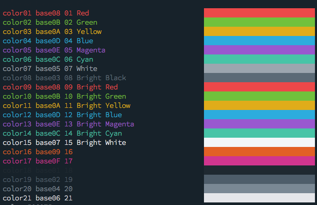
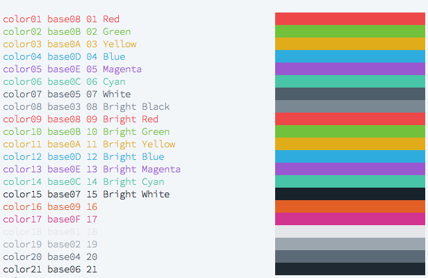

# Base16 Solarflare Scheme

This repo re-hosts the [Base16 Solarflare theme originally authored by Chuck Harmston](https://github.com/chriskempson/base16-builder/tree/master/schemes/solarflare.yml).
This re-hosting is necessary to work with the Base16 v0.9.0 repository scheme.

## Example

Solarflare

Solarflare Light 

## License
[MIT License](./LICENSE)
